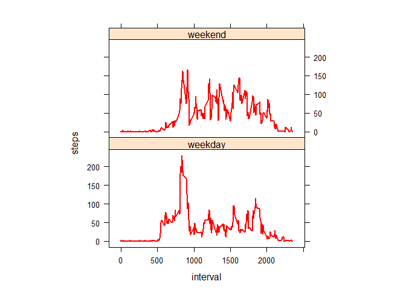

========================================================

Loading the data
----------------

-   Load the data

<!-- -->

    # path<-"~/proj1"
    # setwd(path)
    #dir()  #to check data file is present in the same directory or not.
    if(!"activity" %in% ls()) 
        activity<-read.csv("activity.csv")

    #understanding data
    # names(activity)
    # [1] "steps"    "date"     "interval" , interval fro 0 to 2355 for a given day

-   Process/transform the data (if necessary) into a format suitable for
    your analysis

<!-- -->

    stepsPerDay<-aggregate(steps~date,data=activity,sum,na.rm=TRUE)

Q. What is mean total number of steps taken per day?
----------------------------------------------------

-   Make a histogram of the total number of steps taken each day

<!-- -->

    hist(stepsPerDay$steps, breaks = 15, col="blue")

-   Calculate and report the **mean** and **median** total number of
    steps taken per day

<!-- -->

    mean(stepsPerDay$steps)

    ## [1] 10766.19

    median(stepsPerDay$steps)

    ## [1] 10765

-   The **mean** total number of steps taken per day is
    1.076618910^{4} steps.
-   The **median** total number of steps taken per day is 10765 steps.

Q. What is the average daily activity pattern?
----------------------------------------------

-   Make a time series plot (i.e. type = "l") of the 5-minute
    interval (x-axis) and the average number of steps taken, averaged
    across all days (y-axis)

<!-- -->

    Avg_steps_PerInterval<-aggregate(steps~interval,data=activity,mean,na.rm=TRUE)
    plot(Avg_steps_PerInterval,type='l',lwd=2,col="red")

-   Which 5-minute interval, on average across all the days in the
    dataset, contains the maximum number of steps?

<!-- -->

    Avg_steps_PerInterval[which.max(Avg_steps_PerInterval$steps),]$interval

    ## [1] 835

It is the
**`Avg_steps_PerInterval[which.max(Avg_steps_PerInterval$steps),]$interval`th**
interval where maximum steps occurs.

Q. Imputing missing values and how they changes results
-------------------------------------------------------

-   Calculate and report the total number of missing values in the
    dataset (i.e. the total number of rows with NAs)

<!-- -->

    sum(!complete.cases(activity))

    ## [1] 2304

Total 2304 rows are missing with a value NA.

-   Devise a strategy for filling in all of the missing values in
    the dataset. The strategy does not need to be sophisticated. For
    example, you could use the mean/median for that day, or the mean for
    that 5-minute interval, etc.

: Strategy I adopted here, for filing in all of the missing values with
the mean for that 5-minute interval. First of all, I coded a function
**"filling"** to get the mean steps for particular 5-minute interval.

    filling<-function(interval){
        Avg_steps_PerInterval[Avg_steps_PerInterval$interval==interval,]$steps
    }

-   Create a new dataset that is equal to the original dataset but with
    the missing data filled in.

<!-- -->

    activityFilled<-activity   # Make a new dataset with the original data
    for(i in 1:nrow(activityFilled)){
        if(is.na(activityFilled[i,]$steps)){
            activityFilled[i,]$steps<-filling(activityFilled[i,]$interval)
        }
    }
    #sum(is.na(activityFilled))  # returns 0, as a check that no more missing values. 

-   Make a histogram of the total number of steps taken each day and
    Calculate and report the mean and median total number of steps taken
    per day.

<!-- -->

    stepsPerDay2<-aggregate(steps~date,data=activityFilled,sum,na.rm=TRUE)
    hist(stepsPerDay2$steps, breaks = 15, col="green")

    mean(stepsPerDay2$steps)

    ## [1] 10766.19

    median(stepsPerDay2$steps)

    ## [1] 10766.19

-   The **mean** total number of steps taken per day is
    1.076618910^{4} steps.
-   The **median** total number of steps taken per day is
    1.076618910^{4} steps.

-   Do these values differ from the estimates from the first part of the
    assignment? What is the impact of imputing missing data on the
    estimates of the total daily number of steps?

: The **mean** value is the **same** as the value before imputing
missing data because we put the mean value for that particular 5-min
interval. This is why **mean** is unchanged. The median value shows **a
little** difference : but it depends on **location of missing values in
data set, particularly which day, which interval is missing.**.

Q. Are there differences in activity patterns between weekdays and weekends?
----------------------------------------------------------------------------

-   Create a new factor variable in the dataset with two levels –
    “weekday” and “weekend” indicating whether a given date is a
    weekday or weekend day.

<!-- -->

    activityFilled$day=ifelse(as.POSIXlt(as.Date(activityFilled$date))$wday%%6==0,
                              "weekend","weekday")
    # For Sunday and Saturday : weekend, Other days : weekday 
    activityFilled$day=factor(activityFilled$day,levels=c("weekday","weekend"))

-   Make a panel plot containing a time series plot (i.e. type = "l") of
    the 5-minute interval (x-axis) and the average number of steps
    taken, averaged across all weekday days or weekend days (y-axis).
    The plot should look something like the following, which was
    creating using simulated data:

<!-- -->

    stepsInterval2=aggregate(steps~interval+day,activityFilled,mean)
    library(lattice)
    xyplot(steps~interval|factor(day),data=stepsInterval2,aspect=1/2,type="l",lwd=2, col="red")

